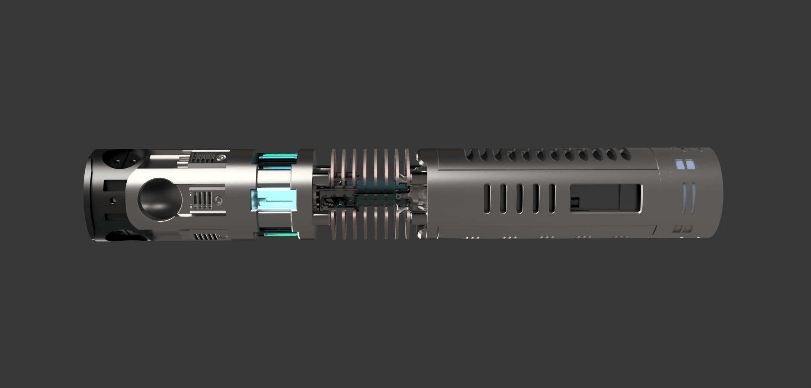

# Secura Chassis Manual
***

## Main Chassis Parts: 
This manual will be broken into sections for each main component and their assembly details. 
There will be additional sections for various other assembly and wiring needs. 
***

> [!IMPORTANT]
> - Files OR Folders with NOP mean "NoPrint" - these are for reference or people who want to print these parts instead of using hardware or laser cut parts. These are generally untested in a printable form and intended to use parts from the BOM instead. 

## Glossary: 

- ### Part descriptions and details 
  - [Secura Chassis ](pages/Secura-chassis.md)
  - [Secura Crystal Chamber and Plasma Gate](pages/Secura-crystalChamber.md)
  - [Secura Emitter ](pages/Secura-emitter.md)
  - [Secura Speaker](pages/Secura-speaker.md)
- ### Assembly Documentation 
  - #### General 
    - [Materials](pages/materials.md) (Recommended 3d printing materials)
    - [Tools and Consumables](pages/tools-consumables.md) (recommended Tools)
    - Finishing Parts
    - [Wiring](pages/wiring.md)
    - Tapping
    - [Suppliers](pages\suppliers.md)
  
  - #### Secura Chassis Assembly 
    - [Secura Chassis ](pages/Secura-chassis-assembly.md)
    - [Secura Crystal Chamber and Plasma Gate](pages/Secura-crystalChamber-assembly.md)
    - [Secura Emitter ](pages/Secura-emitter-assembly.md)
    - [Secura Speaker](pages/Secura-speaker-assembly.md)