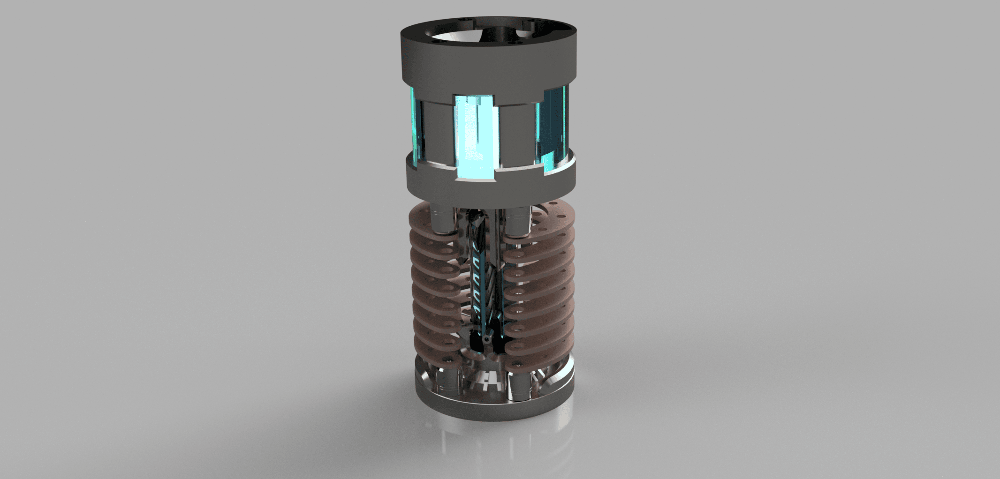
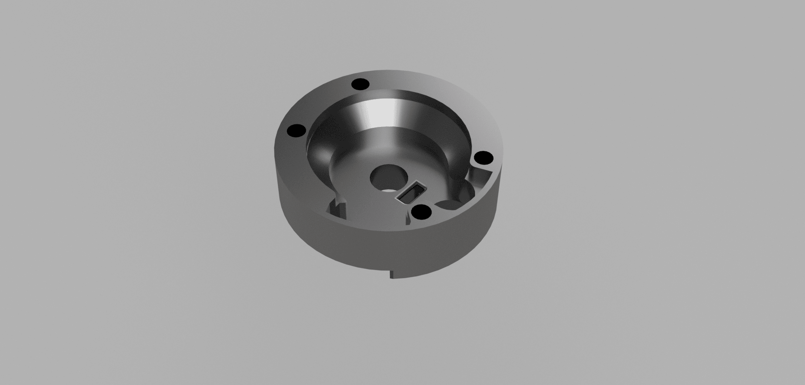
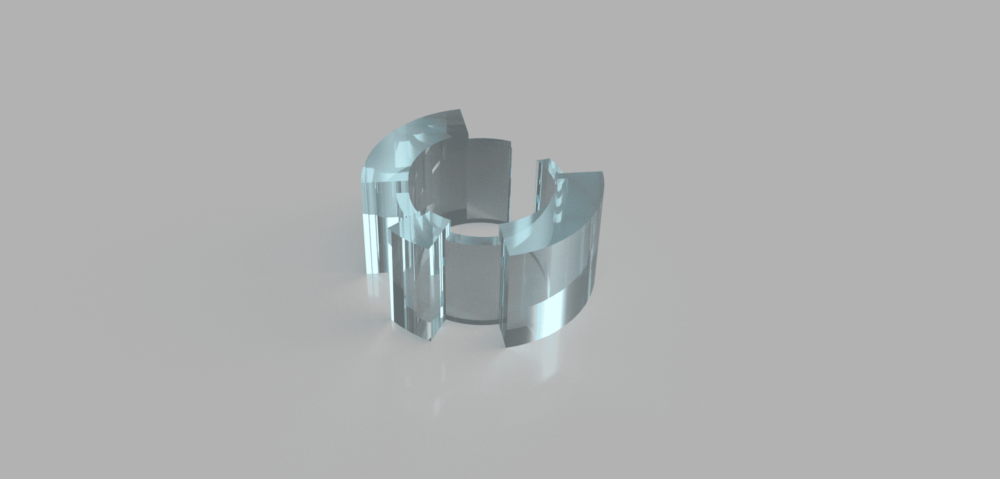
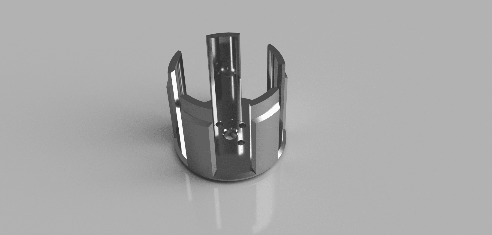
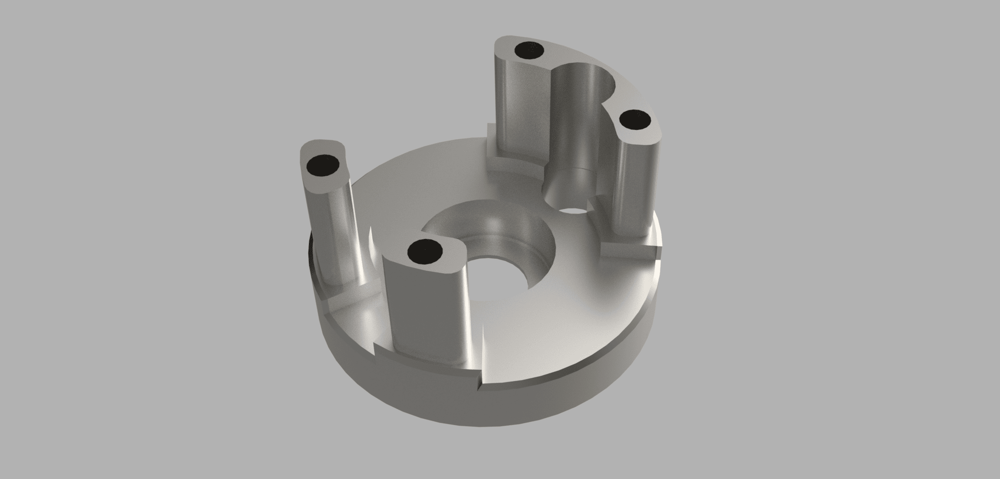
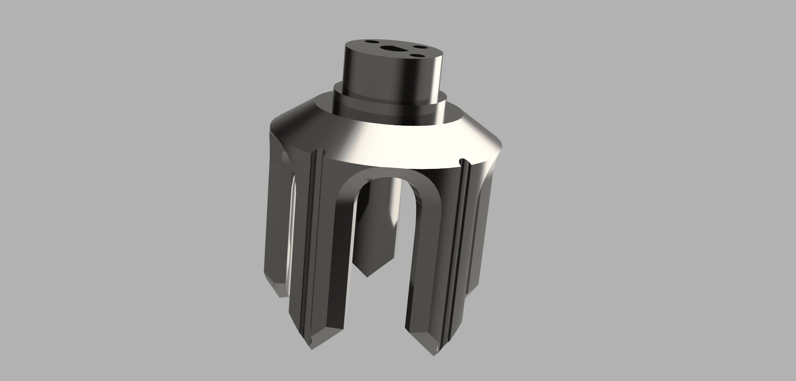
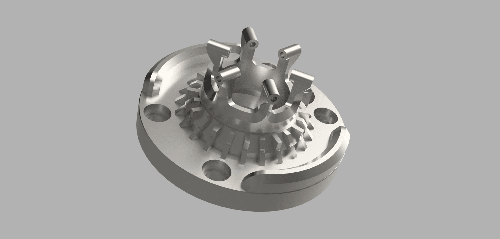
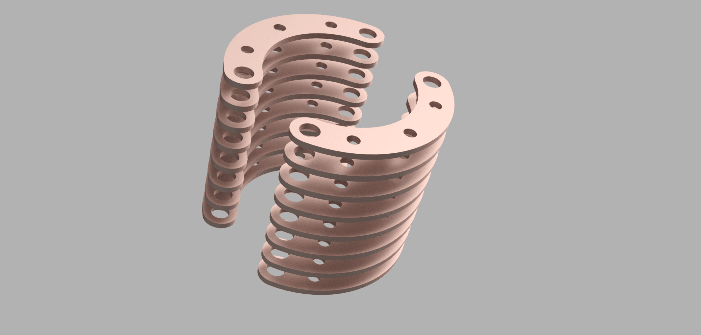

# Secura Crystal Chamber
_Blade holder, buttons and chassis side blade pins_
***
## Navigation: [Manual](README.md) / Secura-crystalChamber.md
***

***

https://github.com/user-attachments/assets/aa2abbda-b485-40cf-995b-76118d8b39da

***
## Crystal Chamber Part Highlights:

> [!IMPORTANT]
> - It is our strong recommendation to have the chassis parts SLM printed from metal
> - The "cooling fins" should be laser cut - you can print these but it is not rigid.

***

## TOC
[Manual](README.md) / Secura-crystalChamber.md
- [SPG-top](#spg-top)
- [SPG-window](#spg-window)
- [SPG-reactor](#spg-reactor)
- [SPG-base](#spg-base)
- [SPG-collector](#spg-collector)
- [CC-base](#cc-base)
- [CC-fins](#cc-fins)

## SPG-top
***
[to TOC &uarr;](#toc)
***

> [!IMPORTANT]
> - you may need some filing/sanding to fit the hilt-side pixel PCB. do not sand too much, it should snap in with glue as optional.
> - use a piece of marble tile (flat surface - "poor mans" surface plate ) to flatten the mating surface 

> [!NOTE]
> - Assembly of this part is tedious 
> - This (with the window and SPG-base) houses the hilt side pixel pcb, 3-stage micro motor, LEDs for plasma gate, and switch wiring. 
> - You can use a single or dual stage motor for faster plasma gate spinning, but a 3 stage is recommended. 

You must build the entire plasma gate assembly and install it in one piece - test the components once assembled to ensure everything is smooth and moves freely. 
Once assembled, this slides onto the 4-40 rods mounted in the emitter section 

## SPG-window
***
[to TOC &uarr;](#toc)
***

> [!IMPORTANT]
> - Print SLA in clear resin - do not print in metal 
> - light sanding might be needed to reduce the height for best fitment. 
> - you might want to have 2x printed just in case you break one 

> [!NOTE]
> Not all SLA resin is the same, some is much more brittle or less clear. 3d printing services simplify this and typically use ultra-clear durable engineering resins. 

This part allows you to see the spinning plasma gate while protecting it from dust and debris. This is intentionally thick to magnify the internals - you can "shell" this piece for less maginification or to provide a different effect. 
Even with professional resins this piece can be brittle on the thin sections, this is drastically reduced when installed. 

## SPG-reactor
***
[to TOC &uarr;](#toc)
***

> [!IMPORTANT]
> - we recommend the usage of a 3-stage 6mm micro motor - this is the best option for size and speed control 
> - this will NOT fit a 4-stage motor 

> [!NOTE]
> - This part is keyed for alignment with the SPG-collector - 1mm brass rod (with glue) can be used for pins to connect the 2 pieces 
> - polishing the inside and outside of this part helps with light transmission and reflectivity effect.

The micro motor slots into the center of this piece. the shaft hole is keyed to match the key on the micro motor. 
The bottom end of this part sits in the 7x14x5 ceramic bearing, sandwiched between the motor and bearing. 
Micro LED strips or Medium Shtok pixel rings are installed around the motor. 
clearances MUST checked to ensure free movement and that no parts are rubbing.  

## SPG-base
***
[to TOC &uarr;](#toc)
***

> [!IMPORTANT]
> - the 7x14x5 ceramic bearing must be carefully glued into this piece - make sure the glue is only applied to the outside

> [!NOTE]
> - you can wrap the "posts" in 24g magnet wire for added visual effect as a containment chamber. 
> - polishing this part helps with light transmission and effect. 

This part houses the movement aspects of the plasma gate assembly and ties the crystal chamber together with the plasma gate assembly. 
you will need to glue in the bearing and SPG-reactor during assembly - this ensures durability. 

## SPG-collector
***
[to TOC &uarr;](#toc)
***

> [!IMPORTANT]
> - this part might need some sanding to the top surface for mating to the bottom of the SPG-reactor inside the bearing 
> - the diameter should fit snuggly in the bearing but due to printing inaccuracies it might require some sanding for press fitment. 

> [!NOTE]
> - polish this part to help reflect light from the crystal 

this is the visible exposed part that spins around the actual crystal. this is held into the bearing with a combination of glue and 3x 1mm brass rods connecting to the SPG-reactor. 

## SPG-base
***
[to TOC &uarr;](#toc)
***

> [!IMPORTANT]
> - you can use a real quartz crystal and use a combination of glue/resin and 28g magnet wire to secure the crystal. 
> - it is not recommended to bend the prongs - 3d printed metal is very durable but may fracture if bent. 
> - make sure the crystal clears and does not touch the SPG-collector when fully installed - the SPG-collector must spin freely. 

> [!NOTE]
> - polishing this part will increase lighting effect. 
> - this is designed for a single pixel led to be mounted on the underside or beneath the crystal

This piece houses the kyber crystal, and lighting under it. This also serves as the base for the crystal chamber tying the crystal chamber to the plasma gate. 
you will need to install this to check fitment and clearance prior to final assembly. 

## SPG-fins
***
[to TOC &uarr;](#toc)
***

> [!IMPORTANT]
> - This part is intended for laser cut metal parts - printing this part has NOT been tested. 
> - you will need spacers between these - 4-40 heatset inserts work well or 4-40 spacers can be used. 
> - you can use less or more "cooling fins", however 6-7 (per side, 12-14 total) fit well inside a Graflex chassis based on spacer height - you may need less or more based on fitment.

> [!NOTE]
> - polishing this part will increase lighting effect.
> - you can pick your material - brass, copper, and titanium have been tested. 

PLEASE have these laser cut, preliminary tests using 3d printed parts have provided inconsistent results and can lead to misalignment. 
If you use a threaded spacer between fins assembly and testing can be more tedious - unthreaded spacers can help with assembly. 
