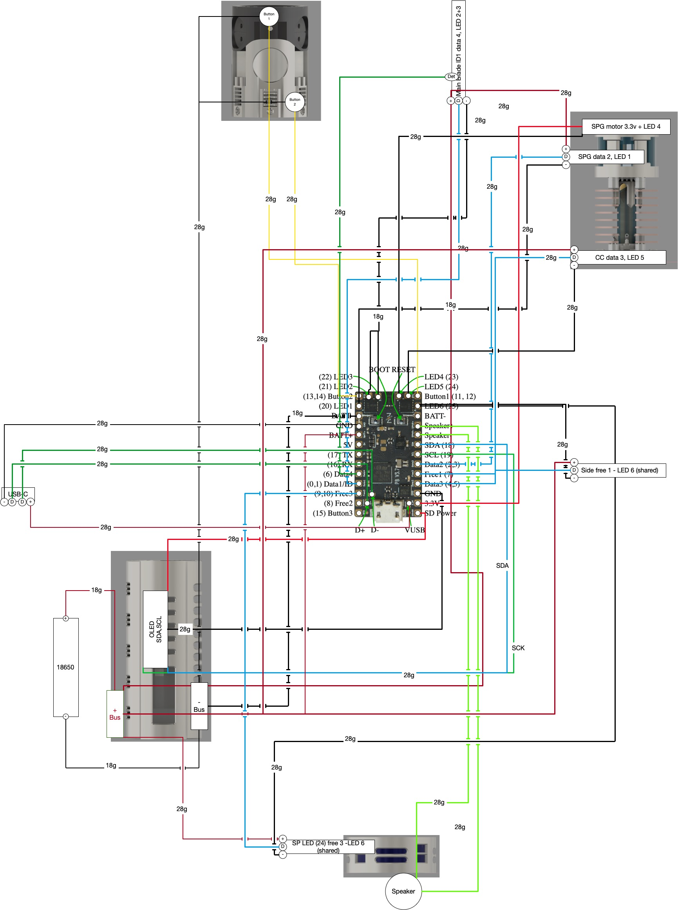

# Wiring
***
## Navigation: [Manual](../README.md) / Wiring.md
***

Recommended tools for assembly - this is NOT about brands, but the functional underlying tool. We might make recommendations on brand solely because we find it to be better in some way, but that does not mean another manufacturer could be just as good or better.

## TOC
[Manual](../README.md) / Wiring.md
- [Blade Wire Gauge](#blade-wire-gauge)
- [Chassis Wire Gauge](#chassis-wire-gauge)
- [Wiring Diagram](#wiring-diagram)

***
## Blade Wire Gauge
***
> [!IMPORTANT]
> - This is for wiring the positive and negative connections from the chassis neopixel connector to the battery/board
> - Smaller gauge = thicker = harder to work with and route, choose carefully 
> - Assumes a standard 143 pixel per-strip
> - Assumes "white" as a blade style for maximum draw 
> - these are safe values, you can get away with less but we recommend safe.

| **LED Strip Count** | **AMPS** | **Single Wire Gauge** | **Double Wire Gauge** | **NOTES**                                                                                  |
|---------------------|----------|-----------------------|-----------------------|--------------------------------------------------------------------------------------------|
| 1 x 143 pixels      | 5.2      | 22g                   | -                     | not recommended                                                                            |
| 2 x 143 pixels      | 10       | 20g                   | 2x 24g                | Most common for standard blades and pixel sticks                                           |
| 3 x 143 pixels      | 14.5     | 18g-19g               | 2x 23g                | Ideal for more complex blades and pixel sticks                                             |
| 4 x 143 pixels      | 18       | 16g-18g               | 2x 22g                | Slightly overkill, but 18g will handle most anything you throw at it - this is what i use. |
| 5 x 143 pixels      | 20.5     | 16g or lower          | 2x 20g                | extreme and untested in this chassis                                                       |

> [!CAUTION]
> - High amp connections can present dangerous conditions - proceed carefully. 
> - undersized wires can cause the wires to overheat causing an equally dangerous scenario 
> - make sure your battery supports the amp rating for CONSTANT draw 

[to TOC &uarr;](#toc)

***
## Chassis Wire Gauge
***
> [!IMPORTANT]
> - In many cases I use 28G for the remainder if the internals 
> - these are approximate ranges, you should always do the appropriate calculations 

| **Chassis Part** | **Wire Gauge** | **NOTES**                                                   |
|------------------|----------------|-------------------------------------------------------------|
| Accent LEDs      | 28-30g         | I use 30g for data and 28g for power/ground                 |
| OLED             | 28g            | you can use 30g but I have had better success with 28g      |
| Speaker          | 26-28g         | even with a large speaker (33mm) the 28g does a perfect job |
| Micro motor      | 28-30g         | 30g is fine, but 28 will fit and work well                  |
| switches         | 28-30g         | 30g is fine, but 28 will fit and work well                  |

> [!CAUTION]
> - pay attention to your wires, dont fry your board. 

[to TOC &uarr;](#toc)

***
## Wiring Diagram
***
> [!IMPORTANT]
> - this my not be the most elegant way to do things - you can likely combine some wires
> - I recommend explicit wires instead of wire-sharing, this eliminates wire noise

[Secura-wireDiagram.pdf](https://github.com/user-attachments/files/20558570/Secura-wireDiagram.pdf)

> [!CAUTION]
> - pay attention to your wires, dont fry your board.

[to TOC &uarr;](#toc)
