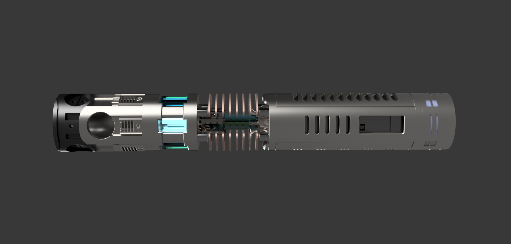

# Secura Chassis Manual

## Main Chassis Parts: 
This manual will be broken into sections for each main component and their assembly details. 
There will be additional sections for various other assembly and wiring needs. 

## Glossary: 
- [Secura Chassis ](Secura-chassis.md)
- [Secura Crystal Chamber and Plasma Gate](Secura-crystalChamber.md)
- [Secura Emitter ](Secura-emitter.md)
- [Secura Speaker](Secura-speaker.md)