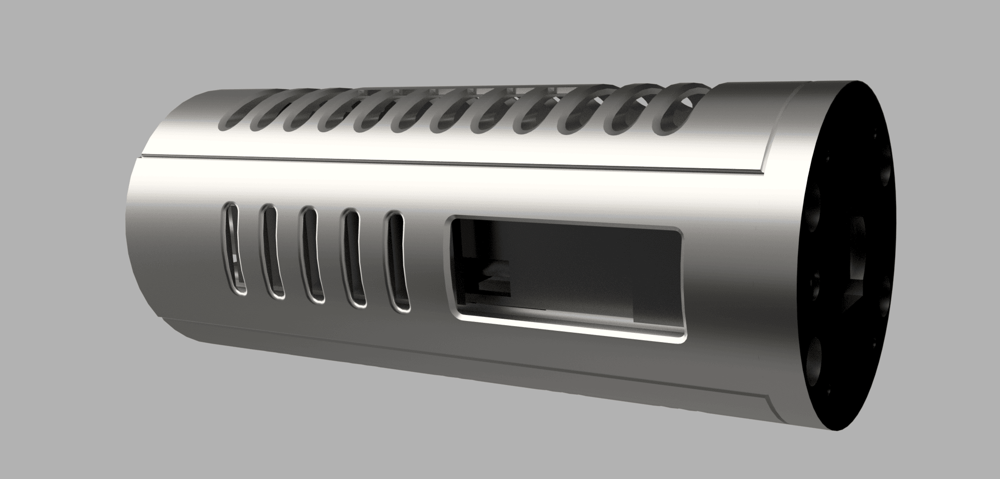
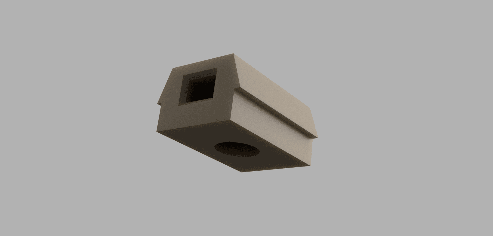
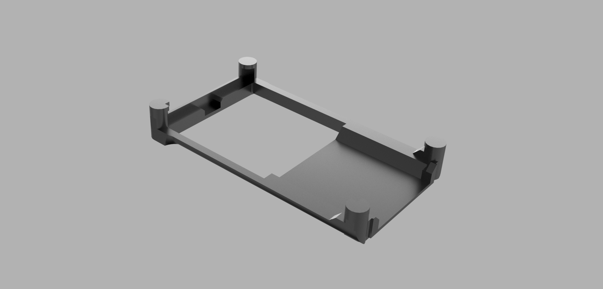
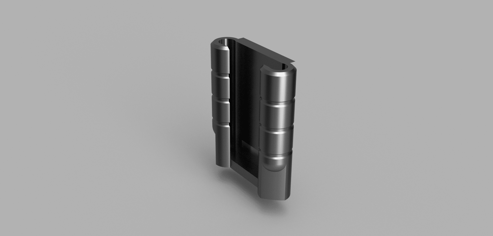
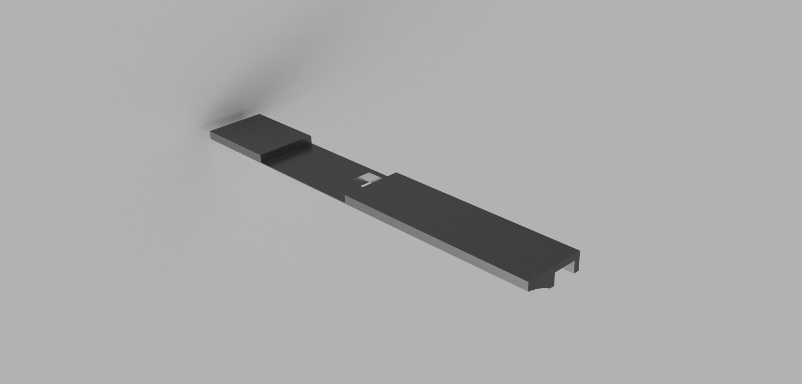
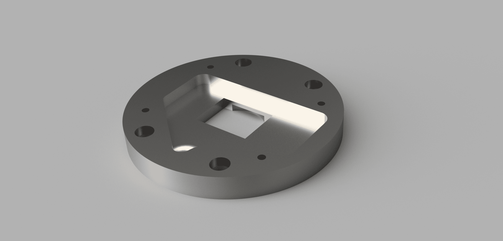
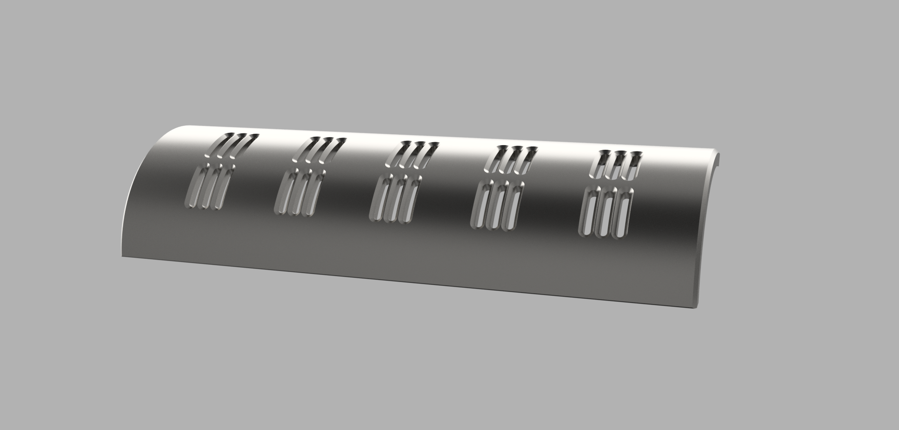
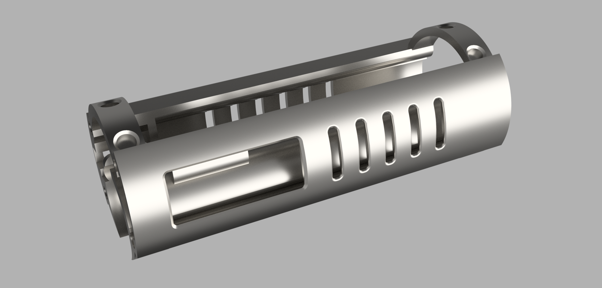
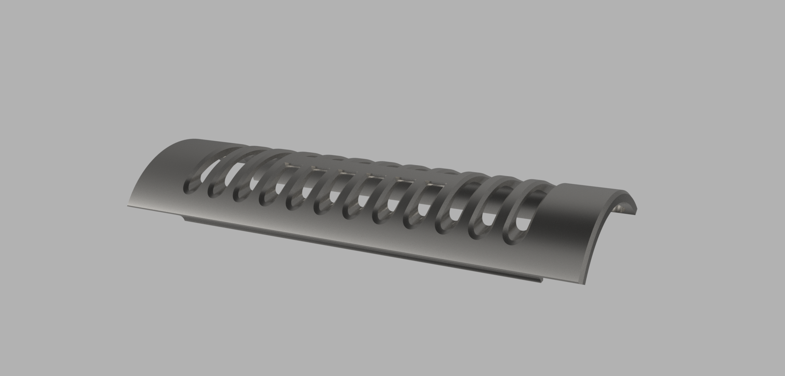

# Secura Chassis 
_electronics and battery_
***

***
https://github.com/user-attachments/assets/cefb1376-12e1-43ca-87cb-c5749daabf90
***
## Chassis Part Highlights: 
> [!CAUTION]
> All parts with "..ISO.." in the name are isolation parts and must be printed in approved plastics

> [!IMPORTANT]
>It is our strong recommendation to have the chassis parts SLM printed from metal 

***

## Tested ISO Materials compatibility:

> [!NOTE]
> This is NOT an exhaustive list, other materials may be sutible.
> List will be updated over time

| **MATERIAL**          | **METHOD** | **APPROVAL**           | **NOTES**                                                       |
|-----------------------|------------|------------------------|-----------------------------------------------------------------|
| PA12                  | SLS/FDM    | $${\color{green}YES}$$ | non-condustive, resistant to heat, does not deform over time    |
| PA6                   | SLS/FDM    | $${\color{green}YES}$$ | non-condustive, resistant to heat, does not deform over time    |
| ABS                   | FDM        | $${\color{green}YES}$$ | non-condustive, resistant to heat, does not deform over time    |
| ASA                   | FDM        | $${\color{green}YES}$$ | non-condustive, resistant to heat, does not deform over time    |
| PLA                   | FDM        | $${\color{red}NO}$$    | Non-Condustive, deforms under heat, deforms over time           |
| PETG                  | FDM        | $${\color{red}NO}$$    | Non-Conductive, Handles heat well, deforms over time, not ideal |
| ANY Carbon Reinforced | SLS/FDM    | $${\color{red}NO}$$    | POTENTIALLY conductive - DO NOT USE                             |
| PC (polycarbonate)    | FDM        | $${\color{green}YES}$$ | non-condustive, resistant to heat, does not deform over time    |
| PEEK                  | FDM        | $${\color{green}YES}$$ | Of course this will work, you are borderline crazy              |

***

### 1) Isolation parts - print out of a non-conductive material 
- [CH-ISO_Battery ](#ch-iso_battery)
- [CH-ISO_Proffie](#ch-iso_proffie)
- [CH-ISO_BusBar](#ch-iso_busbar)
- [CH-ISO_screen](#ch-iso_screen) 

### 2) Main Body Parts - SLM > SLS > SLA or FDM 
- [CH-base](#ch-base)
- [CH-electronicsDoor](#ch-electronicsdoor)
- [CH-chassis](#ch-chassis)
- [CH-batteryDoor](#ch-batterydoor)

> [!CAUTION]
> DO NOT PRINT CH-batteryTerminal. this is for sizing and comparison - [CH-ISO_Battery ](#ch-iso_battery) has a full description.

## CH-ISO_Battery
***
 
> [!IMPORTANT]
> If you choose to print the entire chassis out plastic instead of metal, this part will need to be merged into the CH-chassis part for ideal rigidity.

The CH-ISO_battery part isolates the battery positive contact from the SLM metal chassis. You will need a piece of 5mm Copper rod to cut a positive battery contact out of, you can use a dremel tool to do this. 
Once the positive terminal is cut out it can be notched and soldered to the wire, then pressed into the CH-ISO-Battery part with the wire exiting the rectangular hole in the rear. 
- we recommend printing this part out of PA12 or PA6 using a SLS method 
- alternatively you can FDM print from PA12 or ABS/ASA 

[CH-ISO_battery STL](../../STL/secura-chassis/CH-ISO_Battery.stl)

## CH-ISO_Proffie
*** 

> [!NOTE]
> The Proffie is mounted with the SD card facing the mount. 

The CH-ISO_proffie part isolates the proffie from the SLM metal chassis. The proffie board is a snug fit, some filing or clipping to the "posts" may be needed depending on the printer accuracy.
this part can be glued to the chassis body (CH-chassis) to improve rigidity, but it will press into place as-is. 
- we recommend printing this part out of PA12 or PA6 using a SLS method
- alternatively you can FDM print from PA12 or ABS/ASA

## CH-ISO_BusBar
***

> [!TIP]
> this is an OPTIONAL part 

The CH-ISO_busBar part is optional, it is intended to use 2x 3mm copper tubes as the positive and negative common. This allows installers to have a clean way to tie multiple leads to positive or negative to drive various components. 
this can wholly be omitted in favor of wire heat shrink and tucking. 
Should you choose to use this part you will need 3mm thick wall copper tubing, cut to length and solder points cut/drilled in the tube to support the number of connections you need. 

## CH-ISO_Screen
*** 

> [!NOTE]
> The screen is mounted to the topside with wires running behind it. additionally, a LED strip can be affixed to the top side to show through the chassis venting. 

The CH-ISO_screen part is to keep the OLED isolated from the SLM metal chassis body. it also allows the wires to run behind it, concealing them from view. This part provides a snug fit for the screen against the main chassis. 
> [!TIP]
> you may need to sand down thi part of a perfect fit depending on how much finish work you put into the SLM metal body. 

## CH-base
*** 

> [!IMPORTANT]
> you will need to tap 4x M1.4 holes in this piece to hold the speaker enclosure 

> [!TIP]
> Assemble calls for 4x 4-40 heatset inserts - these are NOT heat set into the parts, it is instead used as a very small nut that will easily recess into the part when assembled. 

The CH-base part caps off the bottom end of the chassis assembly and allows the speaker holder to be secure screwed in using 4x M1.4 screws. This part has an opening that you can mount a single LED or small Shtok LED ring into. 
the recessed side (in the image) goes towards the chassis, this area is to allow easy routing of electronics and wires

## CH-electronicsDoor
*** 

> [!NOTE]
> This part is NOT interchangable with the CH-batteryDoor

> [!TIP]
> you will need to glue in 6x neodymium magnets - 3mm diameter 1mm thick 

This part covers the electronics of the chassis, it is held on with 6x neodymium magnets that you need to glue in. be VERY cautious during install to keep the magnets in the correct orientation so they do not repel the magnets in the CH-chassis part - these small magnets really like to flip flop. 

## CH-chassis
*** 

> [!NOTE]
> This will require 10x neodymium magnets 3mm diameter x 2mm thick 

The CH-chassis part is the main event, here to house all electronics and wiring. it is a tight fit and will test your patience from time to time. 

## CH-batteryDoor
*** 

> [!NOTE]
> This part is NOT interchangable with the CH-electronicsDoor

> [!TIP]
> you will need to glue in 4x neodymium magnets - 3mm diameter 1mm thick

This part covers the battery within chassis, it is held on with 4x neodymium magnets that you need to glue in. Be VERY cautious during install to keep the magnets in the correct orientation so they do not repel the magnets in the CH-chassis part - these small magnets really like to flip flop.