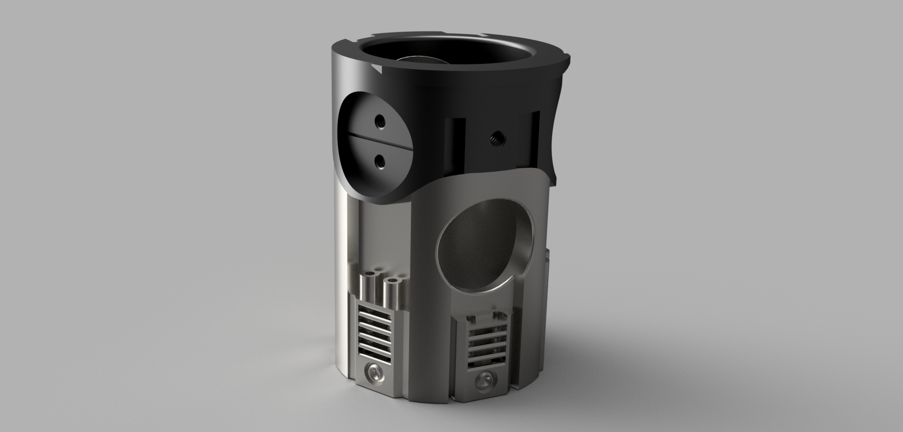
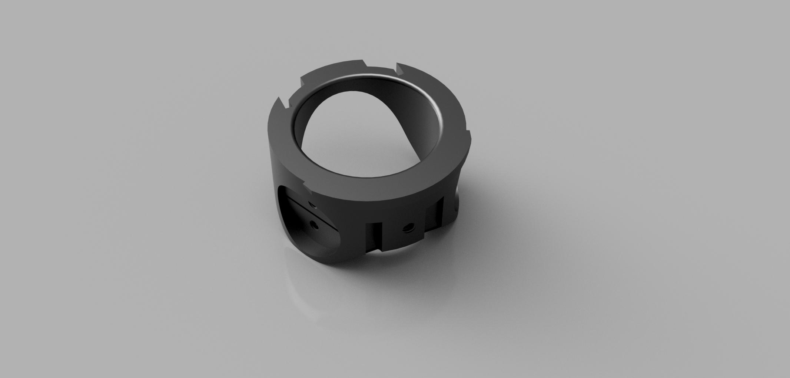
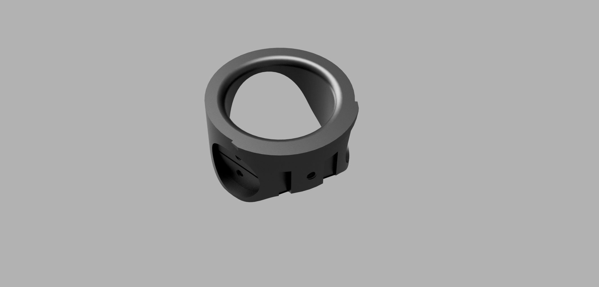
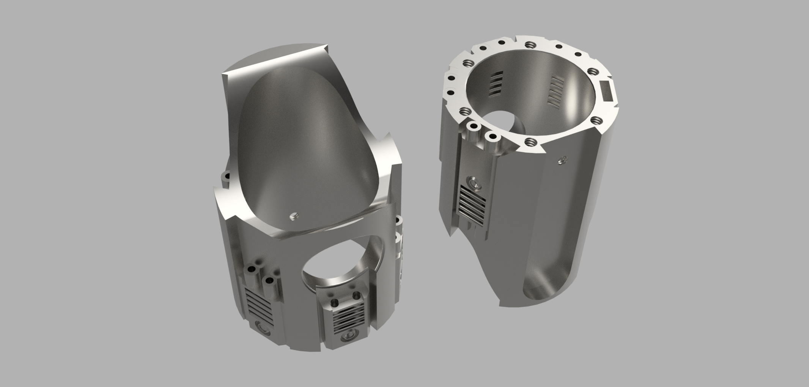
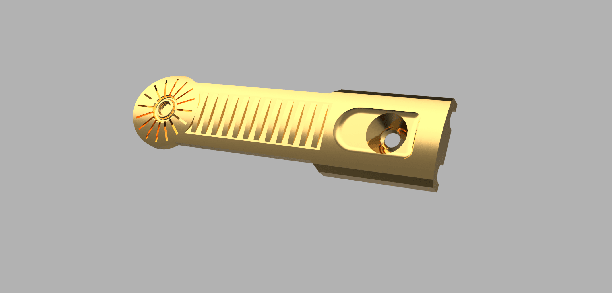

# Secura Emitter
_Blade holder, buttons and chassis side blade pins_
***

***
https://github.com/user-attachments/assets/98bedda8-689d-4d3c-846b-197768a15971
***
## Emitter Part Highlights:
> [!CAUTION]
> You will need to tap many holes in this part. 
> - 4-40 = threaded rods for body support/assembly and to hold the button cover on. 
> - 3-48 = brass pins 

> [!IMPORTANT]
> - It is our strong recommendation to have the chassis parts SLM printed from metal 
> - you only need to print ONE top part, either accurate or without rear notches

***

### Secura Emitter Parts 
- Top (_pick one_)
  - [EM-topAccurate ](#em-topaccurate) - ALT has accurate rear cutouts 
  - [EM-top ](#em-top) - ALT does not have rear cutouts + more of a fillet
- [EM-base](#em-base)
- [EM-button](#em-button)

## EM-topAccurate
***

> [!IMPORTANT]
> the inner diameter will be TIGHT and require sanding to fit a 1"blade - 25.4mm diameter.

> [!NOTE]
> you will need to have this coated/anodized to make it black.

Designed to be an accurate representation of the original Graflex upper - some dimensions may be a little off, I do not have a vintage assembly to compare to. 

## EM-top (alternate)
***

> [!IMPORTANT]
> the inner diameter will be TIGHT and require sanding to fit a 1"blade - 25.4mm diameter.

Designed to have a more rounded entrance for the blade to enter, without the cutouts in the rear. 
> [!NOTE]
> you will need to have this coated/anodized to make it black. 

## EM-base
(image shows top and bottom)
***

> [!IMPORTANT]
> the inner diameter will be TIGHT and require sanding to fit a 1"blade - 25.4mm diameter.

> [!CAUTION]
> the 4-40 holes on the bottom are blind holes, meaning you will need to clear the chips out or you will snap a tap. 
> Additionally, we highly recommend SLM Aluminium - Stainless and Titanium are VERY hard to tap unless you are experienced
> YOU. HAVE. BEEN. WARNED.

https://github.com/user-attachments/assets/6ad42594-aa53-4170-b123-81a9c08d6567

- The emitter is designed with more holes than we need for this project, this was to allow its usage on other projects and chassis. 
- If using for this project you will only need to tap 4x holes, the 2x under the glass eye and the 2x beside the button groove. 
- 1mm brass rod can be used to add accents with the numerous holes throught the "venting" areas. 
- You will need to tap the rear hole 4-40 for a screw to hold the button cover in place - this is not a blind hole and very easy to tap. 
- there is a slot to use a levered microswitch for the alt button, you will need to drill holes (1.2mm) or use glue to mount this. Alternatively you can use other switches but this has not been tested.

## EM-button
(image shows top and bottom)
***

> [!IMPORTANT]
> depending on button selection you may need to sand the emitter then shim under this part to provide clearance.

The button covers the tactile button and is thin enough to bend slightly to actuate the button. A 4-40 screw holds this in place and will need to be ground down so it doesn't protrude into the blade area. 

