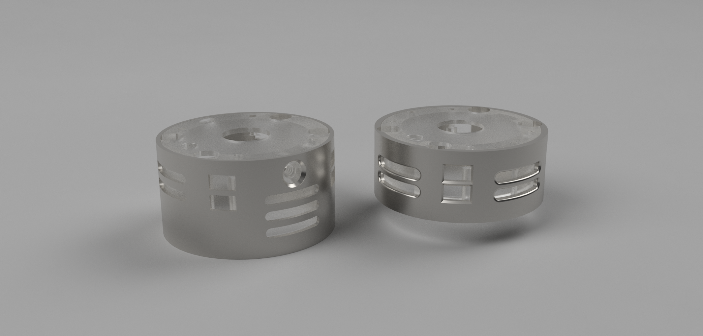
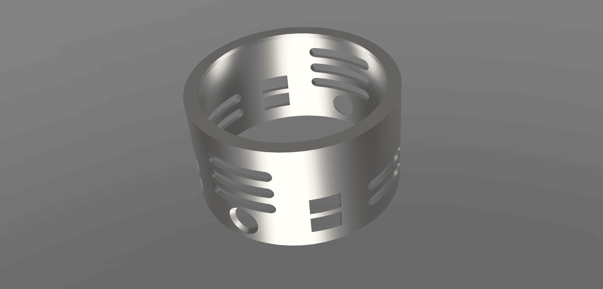
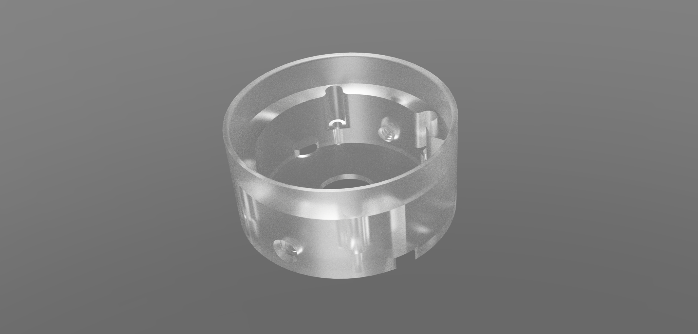
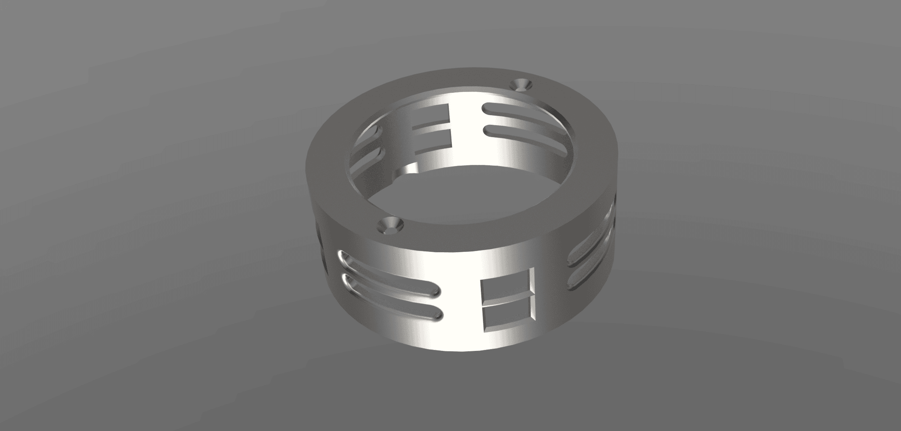
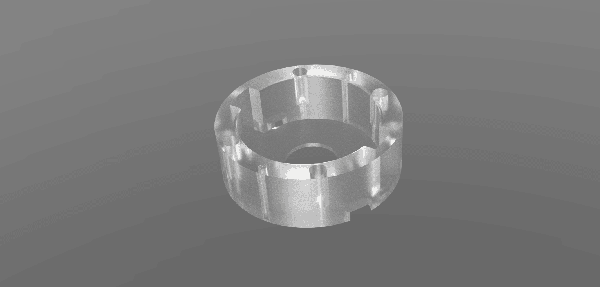

# Secura Speaker
_28mm or 33mm Shtok Titan options_
***

***
## Emitter Part Highlights:
> [!CAUTION]
> - Pick ONE: 33mm for Shtok titan or 28mm 
> - we have tested many 28mm speakers but some may not fit. 

> [!IMPORTANT]
> - for the 33mm version it is highly recommended to use SLM printed metal - plastic/resin tests have not been successful

> [!TIP]
> The sound quality and output produced by the Shtok 33mm Titan is unmatched - it is much trickier to build but has great rewards.

***

### Secura Speaker Parts
pick EITHER: 
- [33mm Shtok Titan](#sp-33mm)
  - [SP-33mm-outer ](#sp-33mm-outer) 
  - [SP-33mm-holder ](#sp-33mm-holder) 

- [28mm Speaker](#sp-28mm)
  - [SP-28mm-outer](#sp-28mm-outer)
  - [SP-28mm-holder](#sp-28mm-holder)

***

# SP-33mm

https://github.com/user-attachments/assets/73da1abb-a244-40c8-bd3c-021bff45e680

## SP-33mm-outer
***

> [!IMPORTANT]
> - you will need to sand the internal diameter for fitment.
> - this is a VERY tight fit, take your time

> [!NOTE]
> you may need to gently file the edge of the speaker basket for perfect fitment .

This houses the Shtok 33mm titan speaker and is a very tight fit, the metal is thin and needs to be treated very carefully. 
this part is held into the SP-33mm-holder with 2x 4-40 screws - you will likely need to cut the screws down so they dont bottom out on the speaker

## SP-33mm-holder
***

> [!IMPORTANT]
> - this must be printed from a transparent/translucent material if you want to use a light at the base of the saber.
> - you may need to sand the external to fit in the SP-33mm-outer part 

> [!NOTE]
> there is very little room for extra wire slack, it is recommended to run the wires and solder in place then pack the speaker in .

This houses the Shtok 33mm titan speaker and is a very tight fit. this part gets attached to the CH-base part with 4x m1.4 screws  

# SP-28mm

https://github.com/user-attachments/assets/f698026a-3095-47ef-9c3f-5bcf8754eda8

## SP-28mm-outer
***

> [!IMPORTANT]
> - you might need to sand the internal diameter for fitment.

> [!NOTE]
> the cover is held on with 2x m1.4 screws - do not over tighten 

this part houses the SP-28mm-holder and uses 2x m1.4 screws to secure in place. A tight fitment is ideal and relieves stresses on the m1.4 screws.

## SP-28mm-holder
***

> [!IMPORTANT]
> - this must be printed from a transparent/translucent material if you want to use a light at the base of the saber.
> - you may need to sand the external to fit in the SP-28mm-outer part

> [!NOTE]
> there is very little room for extra wire slack, it is recommended to run the wires and solder in place then pack the speaker in .

This houses _most_ 28mm speakers, we have tested many variations but there may be 28mm speakers that do not fit. 
